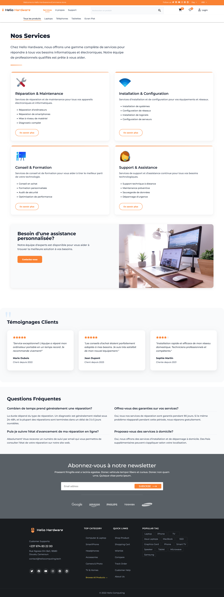
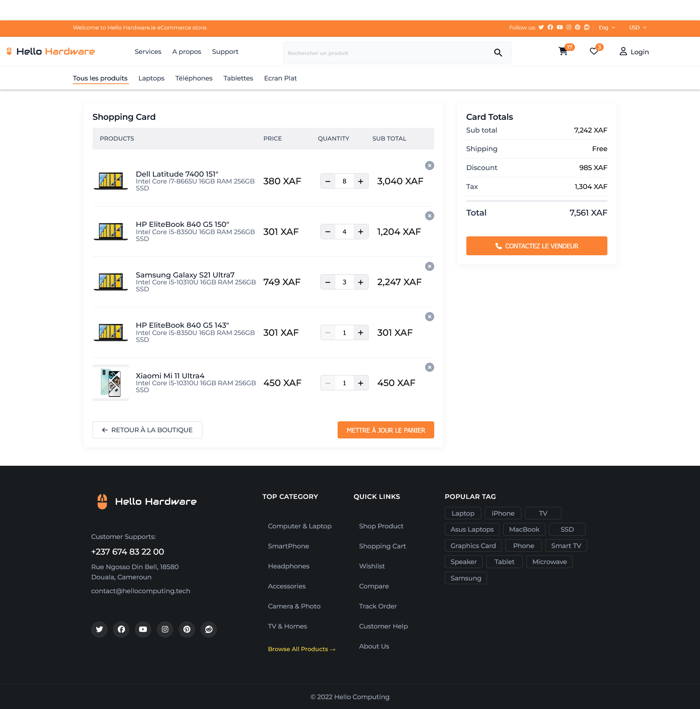

# Hello Hardware

A full-stack application built with NestJS backend and Angular frontend for hardware management systems.

## Description

Hello Hardware is a comprehensive platform for hardware management with a customer-facing interface and back-office administration. The project provides a robust and scalable architecture using modern web technologies.

### Backend (NestJS)

- Built with [Nest](https://github.com/nestjs/nest) framework using TypeScript
- Features:
  - Cache management with Redis
  - JWT and Google OAuth authentication
  - TypeORM for database operations
  - Swagger API documentation
  - Azure Blob storage integration
  - Elasticsearch integration
  - Comprehensive testing setup

### Frontend (Angular)

- Built with Angular v19
- Features:
  - Modern component architecture
  - Proxy configuration for API communication
  - SCSS styling
  - Unit and e2e testing setup

## Prerequisites

Before you begin, ensure you have the following installed:

- Node.js (>= 18)
- npm or yarn
- Git
- Docker
- Windows Subsystem for Linux (WSL) (for Windows users)
- Environment variables configured

## Setup Instructions

### 1. Environment Setup

#### Generate SSH Key (if needed)

```bash
ssh-keygen -t rsa -b 4096 -C "your_email_account.tech"
```

- Add the key to your GitHub account (Settings -> SSH and GPG keys)

#### Install WSL (Windows Users)

```bash
wsl --install
```

#### Install Docker

Follow the official Docker installation guide: [Docker Installation](https://docs.docker.com/desktop/install/windows-install/)

### 2. Project Setup

#### Clone Repository

```bash
git clone git@github.com:JospenWolongwo/hello-hardware.git
cd hello-hardware
```

#### Environment Configuration

1. Copy `.env.example` to `.env`
2. Configure required environment variables
3. Set GitHub token:

```bash
set HC_AUTH_TOKEN=YOUR_TOKEN
```

#### Docker Setup

```bash
docker login
docker compose up -d
```

#### Install Dependencies

```bash
# Install backend dependencies
npm install --force

# Install frontend dependencies
cd client
npm install
cd ..
```

#### Database Setup

```bash
npm run seed:run
```

## Development

### Running the Application

#### Development Mode (Concurrent Frontend & Backend)

```bash
npm run start:dev
```

- Backend will be available at: [http://localhost:3000](http://localhost:3000)
- Frontend will be available at: [http://localhost:4200](http://localhost:4200)

#### Backend Only

```bash
npm run start:dev:server
```

#### Frontend Only

```bash
npm run start:dev:client
```

### Testing

#### Backend Tests

```bash
# Unit tests
npm run test

# e2e tests
npm run test:e2e

# Test coverage
npm run test:cov
```

#### Frontend Tests

```bash
cd client
ng test
ng e2e
```

## Project Structure

```text
hello-hardware/
├── src/                # Backend source files
├── client/            # Angular frontend
├── dist/             # Compiled output
├── test/             # Backend test files
└── docker-compose.yml # Docker configuration
```

## Contributing

1. Ensure you have ESLint and Prettier configured in your IDE
2. The project uses Husky for pre-commit hooks
3. All commits will be linted and formatted automatically

## Screenshots

### Desktop Views

#### Dashboard


#### About


#### Services



#### Support


#### Product Details


#### Shopping Cart



### Mobile View


## License

This project is licensed under the UNLICENSED license.

## Contact

- **Developer**: Jospen Wolongwo
- **Email**: [jospenwolongwo@gmail.com](mailto:jospenwolongwo@gmail.com)
- **Website**: [jospenwolongwo.com](https://jospenwolongwo.com)
- **GitHub**: [JospenWolongwo](https://github.com/JospenWolongwo)
